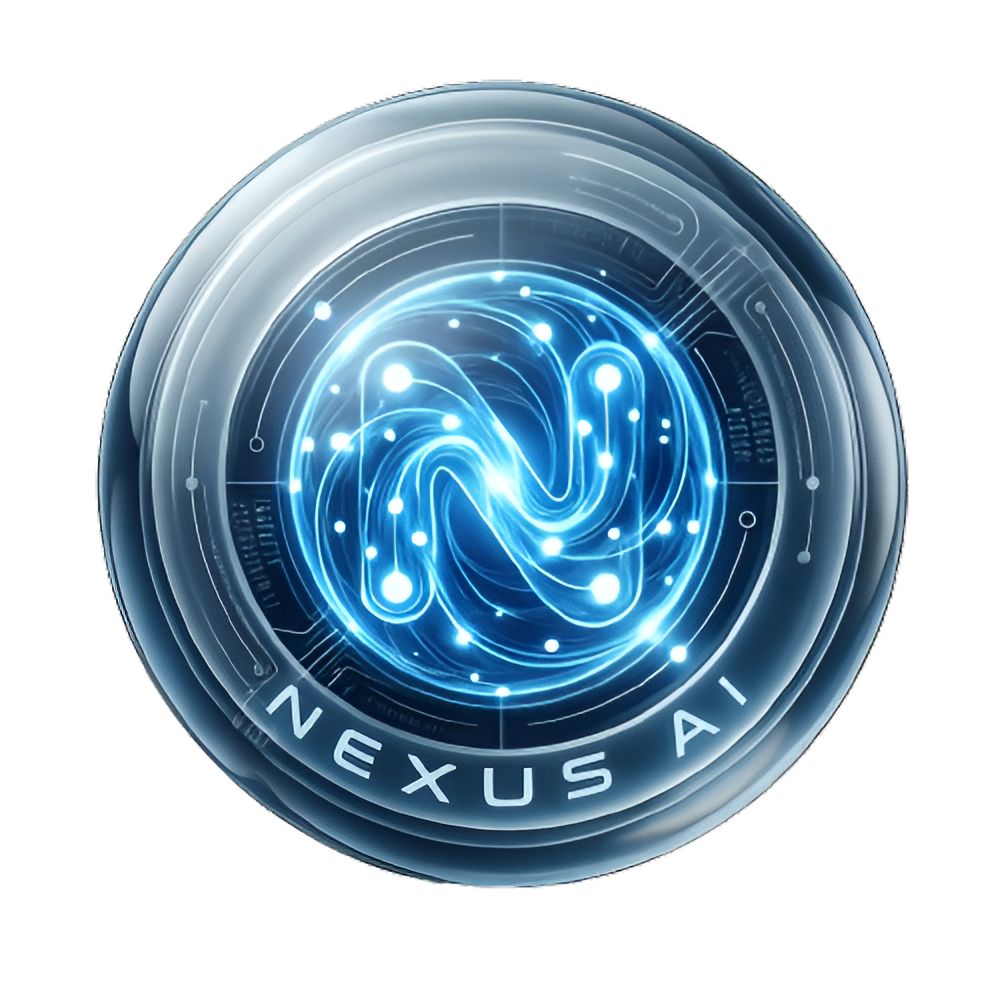

<p align="center">
  
</p>

<h1 align="center">Nexus AI</h1>

<p align="center">
  <strong>Intelligence v2.0 — The Autonomous Multi-Agent Workspace</strong>
</p>

<p align="center">
  
  
  
  
  
  
  
</p>

<p align="center">
  <strong>🎉 Project Completed — February 2026</strong>
</p>

**Nexus AI** is a cutting-edge, autonomous workspace that orchestrates a team of specialized AI agents to solve complex challenges through intelligent collaboration, semantic memory, and robust project orchestration.

---

## 🚀 Quick Start

### Prerequisites
- Python 3.11+
- Node.js 18+
- Groq API Key (or Ollama for local LLM)

### Launch Commands
```bash
# Clone the repository
git clone https://github.com/madhurtyagii/nexus-ai.git
cd nexus-ai

# Backend (Terminal 1)
cd backend
python -m venv new_venv
new_venv\Scripts\activate  # Windows
pip install -r requirements.txt
python main.py

# Frontend (Terminal 2)
cd frontend
npm install
npm run dev
```

### 🔗 Local URLs
| Service | URL |
|---------|-----|
| **Frontend** | http://localhost:5173 |
| **Backend API** | http://localhost:8000 |
| **API Docs** | http://localhost:8000/docs |

---

## ✨ Features

### 🎨 Premium UI/UX
- 🌟 **Ultra-Premium Dashboard** - Glassmorphism with animated gradients
- 🖱️ **Cursor Effects** - 6 customizable effects (Ring, Particles, Ribbon, Aurora, Stardust, Orbit)
- 🌓 **Global Theme System** - Dark/Light mode with radial transitions
- ⌨️ **Command Palette** - Ctrl+K for quick navigation
- 🔔 **Real-time Toasts** - Beautiful notifications with react-hot-toast

### ⚡ Real-time & Interactivity
- 📡 **WebSocket Live Mirroring** - Instant task updates with visual "Live" indicator
- 💬 **Direct Agent Chat** - Communicate directly with any agent
- 📊 **Agent Metrics** - Performance stats and activity charts
- 🎯 **Animated Components** - Framer Motion throughout

### 🧠 Intelligence & Workflow
- 🧠 **RAG for Files** - Semantic search: "Ask Your Files" natural language queries
- 🔀 **Visual Workflow Builder** - Drag-and-drop agent orchestration
- 📤 **Export Engine** - PDF, Markdown, DOCX, JSON exports
- 🔄 **Multi-Phase Project Execution** - Research → Implementation → QA

### 📱 Accessibility
- 📱 **PWA Support** - Install as standalone mobile/desktop app
- 🔽 **Mobile Bottom Nav** - Touch-friendly navigation
- 💅 **Responsive Design** - Safe-area support for notched phones

### ⚙️ Settings & Account
- 👤 **Editable Profile** - Change username & email in Settings
- 🔐 **Password Management** - Secure password updates
- 🎨 **Appearance Controls** - Theme & cursor effect preferences
- 🔑 **API Key Management** - Groq/Ollama provider switching

---

## 🤖 The AI Agent Team

| Agent | Role |
|-------|------|
| 👑 **ManagerAgent** | Orchestrates goals, creates plans, coordinates agents |
| 🔍 **ResearchAgent** | Web research with citations and source validation |
| 💻 **CodeAgent** | Code generation, debugging, software architecture |
| ✍️ **ContentAgent** | Creative writing, documentation, blog posts |
| 🧪 **QAAgent** | Tests outputs, validates requirements, quality checks |
| 📊 **DataAgent** | Data analysis, CSV processing, visualizations |
| 🧠 **MemoryAgent** | Semantic context and long-term memory management |

---

## 🏗️ Architecture

```
┌─────────────────┐     ┌─────────────────┐
│  React (Vite)   │────▶│  FastAPI        │
│  PWA Frontend   │     │  Backend        │
└─────────────────┘     └────────┬────────┘
                                 │
        ┌────────────────────────┼────────────────────────┐
        ▼                        ▼                        ▼
┌───────────────┐      ┌───────────────┐       ┌───────────────┐
│    SQLite     │      │   ChromaDB    │       │   Groq/Ollama │
│  (Database)   │      │ (Vectors/RAG) │       │     (LLM)     │
└───────────────┘      └───────────────┘       └───────────────┘
```

---

## 🎨 Design Highlights

- **Glassmorphism** - Frosted glass effects with backdrop blur
- **Animated Gradients** - Mesh backgrounds with subtle animations
- **Neon Accents** - Cyan/purple color scheme with glow effects
- **Spring Animations** - Smooth, physics-based transitions
- **Dark Mode First** - Deep space theme with high contrast

---

## 📁 Project Structure

```
nexus-ai/
├── frontend/           # React PWA (Vite)
│   ├── src/
│   │   ├── components/ # Reusable UI components
│   │   ├── pages/      # Route pages
│   │   ├── context/    # React contexts
│   │   └── services/   # API client
│   └── public/         # Static assets
│
├── backend/            # FastAPI server
│   ├── agents/         # AI agent implementations
│   ├── routers/        # API endpoints
│   ├── models/         # Database models
│   ├── schemas/        # Pydantic schemas
│   ├── orchestrator/   # Workflow engine
│   ├── memory/         # RAG & vector store
│   ├── llm/            # LLM integrations
│   └── tools/          # Agent tools
│
└── README.md           # This file
```

---

## 🤝 Contributing & License

Nexus AI is released under the [MIT License](LICENSE). Contributions welcome!

---

<p align="center">
  Developed with ❤️ by <a href="https://github.com/madhurtyagii">Madhur Tyagi</a>
</p>

<p align="center">
  <strong>🎉 Project Completed — February 2026</strong>
</p>
