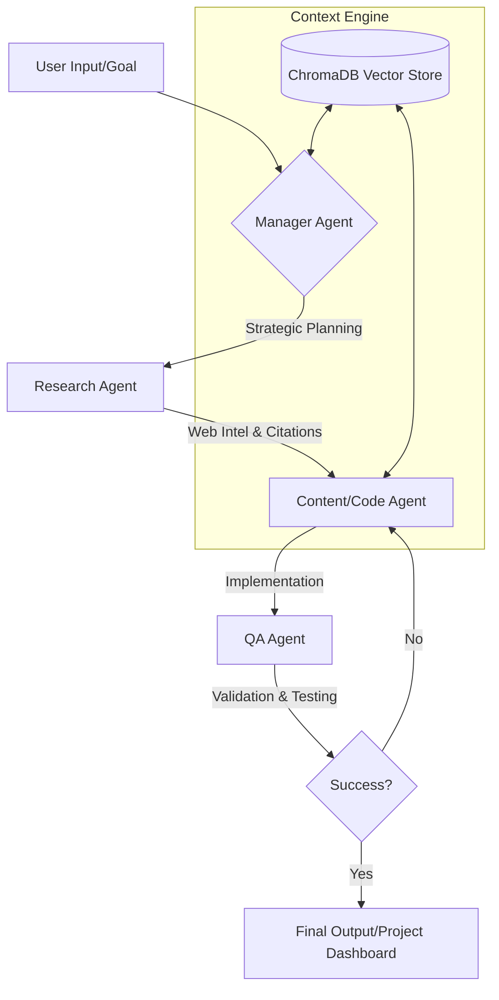
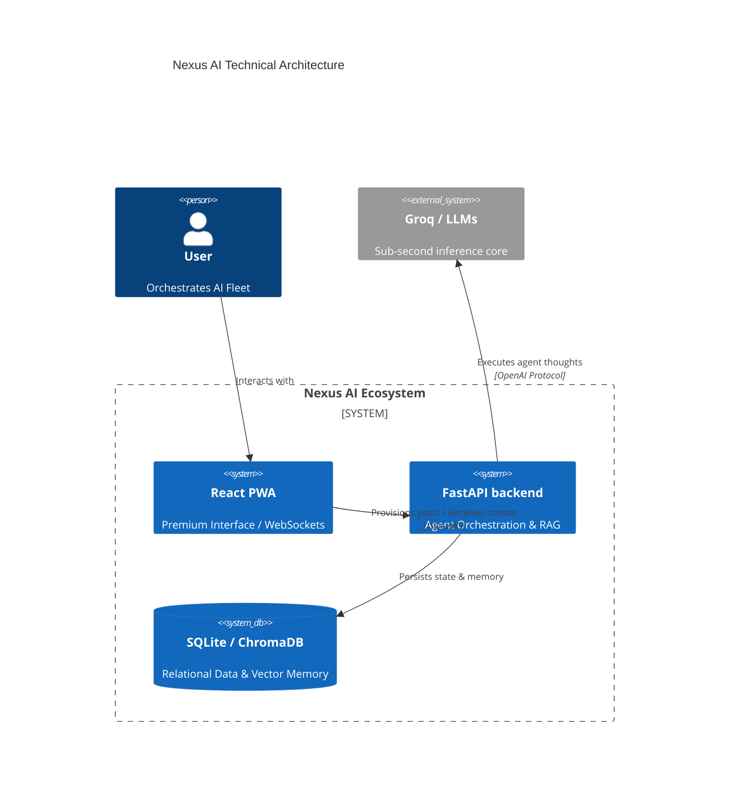

<p align="center">
  
</p>

<h1 align="center">Nexus AI</h1>

<p align="center">
  <strong>The Autonomous Multi-Agent Orchestration Workspace</strong>
</p>

<p align="center">
  
  
  
  
  
</p>

---

## 🌟 Vision
**Nexus AI** represents the next evolution of human-AI collaboration. It is not just another chatbot; it is a **fully autonomous agentic workforce**. Nexus leverages a fleet of 8 specialized AI agents that collaborate, think, and execute complex projects with industrial-grade precision. 

By unifying **Semantic Memory (RAG)**, **Real-time Live Mirroring**, and a **Visionary UI**, Nexus provides a glass-box experience into the future of autonomous software orchestration.

---

## 🚀 How It Works: The Autonomous Pipeline
Nexus operates on a "Collaborative Intelligence" model. When you provide a goal, the system initiates a structured multi-phase execution pipeline:


```mermaid
graph TD
    A[User Input/Goal] --> B{Manager Agent}
    B -->|Strategic Planning| C[Research Agent]
    C -->|Web Intel & Citations| D[Content/Code Agent]
    D -->|Implementation| E[QA Agent]
    E -->|Validation & Testing| F{Success?}
    F -->|No| D
    F -->|Yes| G[Final Output/Project Dashboard]
    
    subgraph "Context Engine"
    H[(ChromaDB Vector Store)] <--> B
    H <--> D
    end
```

1.  **Orchestration**: The `ManagerAgent` breaks down the goal into actionable tasks.
2.  **Intel Gathering**: The `ResearchAgent` performs live web searches to validate constraints and gather data.
3.  **Execution**: `Code` and `Content` agents implement the solution based on research findings.
4.  **Verification**: The `QAAgent` subjects all output to rigorous testing before delivery.

---

## 🤖 The Nexus Workforce
Meet your elite fleet. Each agent is a specialized LLM instance with unique system prompts and toolsets:

| Agent | Capability | Functional Deep-Dive |
|:---:|:---:|---|
| 👑 | **Manager** | Strategic planning, conflict resolution, and multi-agent coordination. |
| 🔍 | **Researcher** | Real-time web intelligence with automated citation and source validation. |
| 💻 | **Coder** | Full-stack implementation, clean-code generation, and architectural design. |
| ✍️ | **Content** | High-fidelity technical writing, blog generation, and creative branding. |
| 🧪 | **QA** | Validation of requirements, logic testing, and quality assurance gating. |
| 📊 | **Data** | Deep analysis of CSV/JSON data with automated visualization mapping. |
| 🧠 | **Memory** | Long-term semantic recall and user-preference learning (RAG). |
| 🎨 | **Visual** | Unified vision analysis, image generation, and conversational art partner. |

---

## 💎 Technical Pillars & Innovation

### 🧠 Semantic Recall (RAG 2.0)
Nexus uses **ChromaDB** as its long-term memory. Every file you upload is indexed into a vector space, allowing agents to "remember" technical documentation, past conversations, and project context with near-zero latency.

### 📡 Live Mirroring (WebSockets)
Experience "Glass-Box" transparency. Every step an agent takes—every thought, every tool call—is broadcasted in real-time to the frontend via **WebSockets**. The UI pulses with life as agents work in the background.

### 🌓 Premium Visual Foundation
The UI is a testament to modern web aesthetics:
- **Off-White Mastery**: A curated premium light mode designed for visual comfort and high-end feel.
- **Aurora Backgrounds**: Animated mesh gradients that react to system state.
- **Micro-Interactions**: Framer Motion powered transitions and physics-based components.
- **Dynamic Cursor System**: 6 unique particle and glow effects that follow your intent.

---

## 🏗️ Architecture Detail


```mermaid
C4Context
    title Nexus AI Technical Architecture
    
    Person(user, "User", "Orchestrates AI Fleet")
    System_Boundary(c1, "Nexus AI Ecosystem") {
        System(web, "React PWA", "Premium Interface / WebSockets")
        System(api, "FastAPI backend", "Agent Orchestration & RAG")
        SystemDb(db, "SQLite / ChromaDB", "Relational Data & Vector Memory")
    }
    
    System_Ext(groq, "Groq / LLMs", "Sub-second inference core")
    
    Rel(user, web, "Interacts with")
    Rel(web, api, "Provisions goals / Receives stream", "JSON/WS")
    Rel(api, db, "Persists state & memory")
    Rel(api, groq, "Executes agent thoughts", "OpenAI Protocol")
```

---

## 📁 Installation & Launch

### Prerequisites
- Python 3.11+
- Node.js 18+
- Groq API Key (The speed engine of Nexus)

### Fast Launch
```bash
# Backend Setup
cd backend
python -m venv venv && source venv/bin/activate
pip install -r requirements.txt
python main.py

# Frontend Setup
cd frontend
npm install
npm run dev
```

---

<p align="center">
  Developed with ❤️ by <a href="https://github.com/madhurtyagii">Madhur Tyagi</a>
</p>

<p align="center">
  <strong>🚀 Nexus AI — Orchestrating the Future of Work.</strong>
</p>
