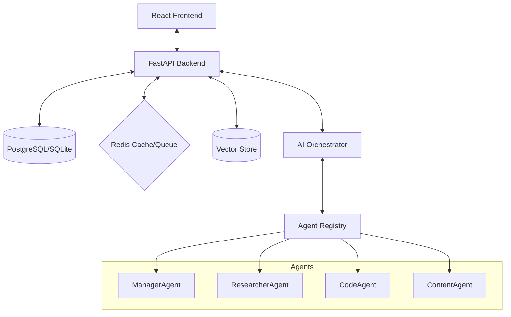
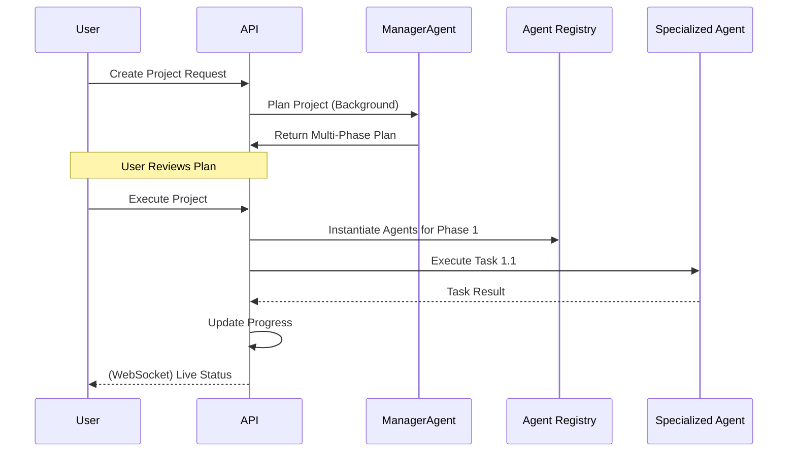

# Nexus AI - System Architecture

Nexus AI is built on a modern, decoupled architecture designed for high performance, modularity, and scalability.

## High-Level Diagram

## Core Components

### 1. Application Layer (FastAPI)
- Handles HTTP requests and WebSocket connections.
- Orchestrates authentication and authorization.
- Manages long-running background tasks via `BackgroundTasks`.

### 2. Orchestration Layer
- **Orchestrator**: Acts as the central traffic controller, parsing user intent and routing to the correct execution path (Single Task vs. Multi-Phase Project).
- **Agent Factory**: Dynamically instantiates agents with their specific configurations and tools.

### 3. Data & Memory Layer
- **Relational DB**: Manages state for users, projects, tasks, and system status.
- **Semantic Memory**: Uses OpenAI embeddings to store and retrieve historical context, enabling agents to "learn" from past interactions.
- **Redis**: Provides fast caching and serves as the backbone for real-time status updates.

## Project Execution Flow

## Security Architecture
- **JWT Authentication**: Secure stateless authentication for all endpoints.
- **Input Sanitization**: Global middleware to prevent XSS and injection attacks.
- **Rate Limiting**: Protection against DDoS and API abuse.
- **Audit Logging**: Sensitive actions are logged for security oversight.

## Future Scaling
Nexus AI is designed to support:
- **Distributed Workers**: Moving task execution to separate worker nodes (e.g., Celery).
- **Multi-Cloud Vector Search**: Support for managed vector stores like Pinecone or Weaviate.
- **Agent Plug-ins**: A plugin-based architecture for third-party agent capabilities.
