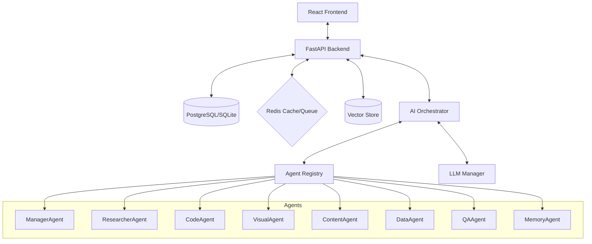
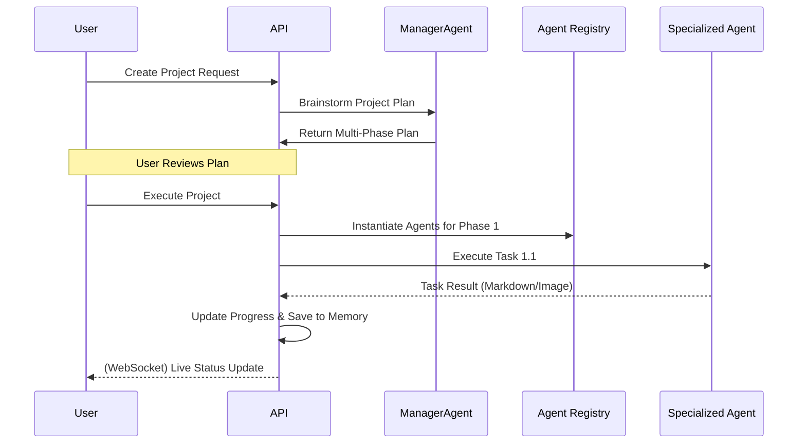

# Nexus AI - System Architecture

Nexus AI is built on a modern, decoupled architecture designed for high performance, modularity, and scalability.

## High-Level Diagram

```mermaid
graph TD
    Client[React Frontend] <--> API[FastAPI Backend]
    API <--> DB[(PostgreSQL/SQLite)]
    API <--> Redis{Redis Cache/Queue}
    API <--> Vector[(Vector Store)]
    
    API <--> Orchestrator[AI Orchestrator]
    Orchestrator <--> AgentRegistry[Agent Registry]
    Orchestrator <--> LLMManager[LLM Manager]
    
    subgraph Agents
        Manager[ManagerAgent]
        Researcher[ResearcherAgent]
        Coder[CodeAgent]
        Visual[VisualAgent]
        Content[ContentAgent]
        Data[DataAgent]
        QA[QAAgent]
        Memory[MemoryAgent]
    end
    
    AgentRegistry --> Manager
    AgentRegistry --> Researcher
    AgentRegistry --> Coder
    AgentRegistry --> Visual
    AgentRegistry --> Content
    AgentRegistry --> Data
    AgentRegistry --> QA
    AgentRegistry --> Memory
```

## Core Components

### 1. Application Layer (FastAPI)
- Handles HTTP requests and WebSocket connections.
- Orchestrates authentication and authorization.
- Manages long-running background tasks via `BackgroundTasks`.

### 2. Orchestration Layer
- **Orchestrator**: Acts as the central traffic controller, parsing user intent and routing to the correct execution path (Single Task vs. Multi-Phase Project).
- **Agent Factory**: Dynamically instantiates agents with their specific configurations and tools.
- **LLM Manager**: A unified interface for interacting with multiple LLM providers (Groq, OpenAI, etc.), handling model selection, caching, and failover.

### 3. Data & Memory Layer
- **Relational DB**: Manages state for users, projects, tasks, and system status.
- **Semantic Memory**: Uses embeddings to store and retrieve historical context, enabling agents to "learn" from past interactions.
- **Redis**: Provides fast caching and serves as the backbone for real-time status updates and session management.

## Project Execution Flow

```mermaid
sequenceDiagram
    participant User
    participant API
    participant Manager as ManagerAgent
    participant Registry as Agent Registry
    participant Agent as Specialized Agent
    
    User->>API: Create Project Request
    API->>Manager: Brainstorm Project Plan
    Manager->>API: Return Multi-Phase Plan
    Note over User, API: User Reviews Plan
    User->>API: Execute Project
    API->>Registry: Instantiate Agents for Phase 1
    API->>Agent: Execute Task 1.1
    Agent-->>API: Task Result (Markdown/Image)
    API->>API: Update Progress & Save to Memory
    API-->>User: (WebSocket) Live Status Update
```

## Security Architecture
- **JWT Authentication**: Secure stateless authentication for all endpoints.
- **Input Sanitization**: Global protection to prevent XSS and injection attacks.
- **Rate Limiting**: Protection against DDoS and API abuse.
- **Audit Logging**: Sensitive actions and agent executions are logged for transparency.

## Future Scaling
Nexus AI is designed to support:
- **Distributed Workers**: Moving task execution to separate worker nodes (e.g., Celery).
- **Advanced RAG Pipelines**: Support for hybrid search and multi-document synthesis.
- **Agent Plugin-ins**: A modular architecture for easy integration of new third-party agent capabilities.
